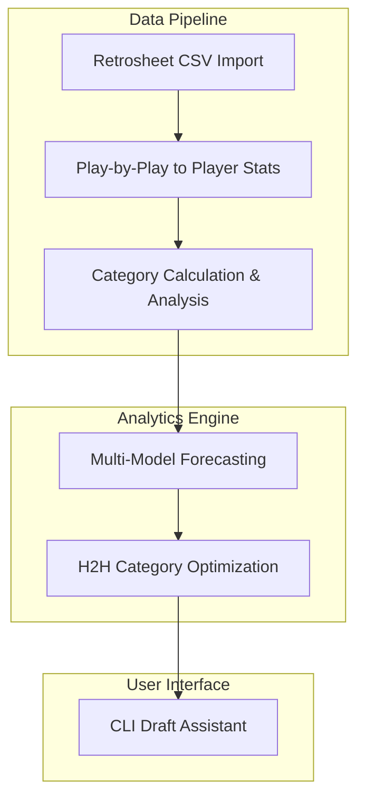

# Fantasy Baseball Draft Tool Plan

## Overview
This document outlines the plan for developing a fantasy baseball draft tool that will help with forecasting player performance and making optimal draft decisions for a head-to-head categories league.

## League Settings
- **Format**: Head-to-Head Categories
- **Hitting Categories (6)**: HR, OBP, R, RBI, SB, TB
- **Pitching Categories (5)**: ERA, WHIP, K, Saves+Holds, Wins+Quality Starts
- **Data Source**: Retrosheet.org CSV dataset

## System Architecture

## 1. Data Collection & Processing

### Retrosheet Data Handling
- Parse Retrosheet play-by-play event files (.EVN, .EVA files)
- Process game logs and roster files
- Handle the specific format of Retrosheet data (fixed width and/or CSV)

### Data Transformation
- Aggregate play-by-play data to player-level statistics
- Calculate derived statistics needed for your categories
- Create player season profiles for the past 10 seasons

## 2. Statistical Analysis

### Category-Specific Analysis
- **Hitting Categories**: HR, OBP, R, RBI, SB, TB
- **Pitching Categories**: ERA, K, SV+H, W+QS
- Analyze category correlations and independence
- Identify category scarcity and surplus

### Player Profiling
- Consistency analysis (variance in performance)
- Platoon splits analysis
- Home/away performance differences
- Age-related performance trends

## 3. Forecasting Models

Multiple forecasting approaches with an ensemble model:

### Time Series Models
- ARIMA (AutoRegressive Integrated Moving Average)
- Exponential smoothing methods
- Weighted recent performance (more weight to recent seasons)

### Regression Models
- Multiple linear regression with feature engineering
- Ridge/Lasso regression to handle multicollinearity
- Random Forest or Gradient Boosting for non-linear relationships

### Baseball-Specific Adjustments
- Age curves by position and player type
- Regression to the mean for outlier performances
- Park factors and team context adjustments
- Injury history impact

## 4. Player Ranking System

### Category Valuation
- Z-score methodology to normalize across categories
- Standard deviation adjusted value (SDAV)
- Category scarcity weighting

### Positional Adjustments
- Value over replacement player (VORP)
- Position scarcity indexing
- Roster construction optimization

### H2H Category Strategy
- Category correlation analysis for balanced team building
- Streaming potential for pitchers
- Category punt analysis (cost/benefit of ignoring categories)

## 5. Draft Tool Interface

### Command-Line Interface
- Real-time draft board tracking
- Player recommendation engine
- Team balance visualization
- Category strength/weakness analysis

### Draft-Day Features
- Best available player recommendations
- Position fill suggestions
- Category balance monitoring
- Value-based drafting assistance

## Implementation Plan

1. **Setup Phase**
   - Create project structure
   - Set up data processing pipeline
   - Implement data cleaning and transformation

2. **Analysis Phase**
   - Implement statistical analysis modules
   - Build forecasting models
   - Create player valuation system

3. **Tool Development Phase**
   - Develop CLI draft interface
   - Implement recommendation engine
   - Create visualization components

4. **Testing & Refinement**
   - Mock drafts to test system
   - Refinement of rankings and recommendations
   - Performance optimization

## Draft Strategy Considerations
- Primary approach: Best available player with flexibility
- Adaptable to position scarcity and category needs during draft
- Focus on balanced roster construction with category strength
